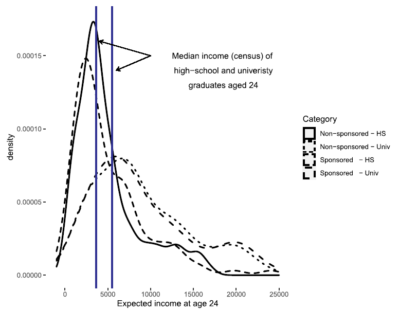
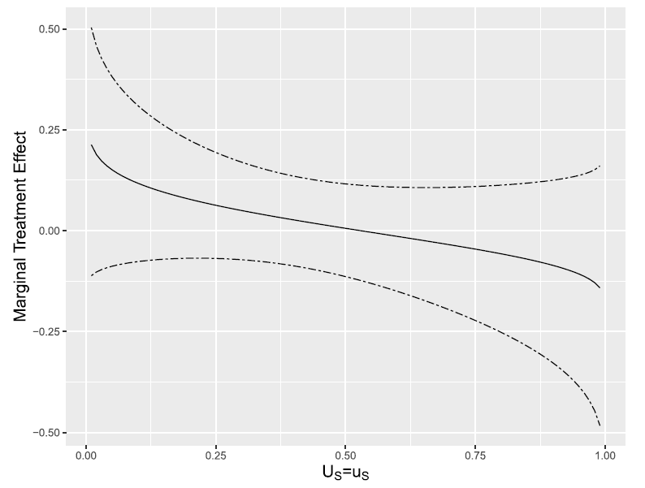

## Why Study Educational Aspirations in Rural Latin America?

::: {.columns}
::: {.column width="55%"}
**The puzzle:** Returns to education are positive and significant — yet [educational attainment remains very low]{.hi-gold}

- Average years of schooling for adults $>24$ in Oaxaca and Chiapas: **7.5 and 7.2 years** (barely above primary)
- Significant returns to higher education exist even for rural populations

**Standard explanation:** [external constraints]{.negative}

- Income, distance to schools, poor health
:::

::: {.column width="42%"}
::: {.methodbox}
**This paper:** Can a holistic child sponsorship program shift children's aspirations toward higher education?
:::

::: {.keybox}
Growing evidence: [internal constraints]{.hi-gold} — aspirations, grit, self-efficacy, self-esteem — also play a critical role [@Cunha2009; @Dalton2016; @Heckman2012]
:::
:::
:::

## Compassion International (CI): A Holistic Sponsorship Program

::: {.columns}
::: {.column width="50%"}
**Compassion International:** Third largest child sponsorship program worldwide

- Sponsors $\approx$**2.2 million children** across **29 countries**
- Faith-based NGO; collaborates with local churches
- In Mexico: **33,360 children** in $>185$ centers

**Duration:** Average **9.3 years** of sponsorship ($\approx$4,000 hrs of organized activities)
:::

::: {.column width="46%"}
**Program components:**

- [In-kind income transfers]{.hi-gold}: school supplies, uniforms, healthcare
- [After-school program]{.hi-gold}: 5–6 hrs/week (socio-emotional development, academic tutoring)
- [Letter exchanges]{.hi-gold} with sponsor: broadens career horizons
- Catastrophic health insurance; access to nurses and doctors
:::
:::

::: {.keybox}
Hypothesis: By broadening horizons and alleviating income constraints, CI may raise children's aspirations to pursue further education
:::

## Research Question and Contributions

::: {.callout-note title="Research Question"}
Does Compassion International's sponsorship program raise the aspiration of rural Mexican children (ages 12–15) to acquire a higher education degree?
:::

**Three contributions to the CI literature:**

1. [Selection into CI modeled explicitly]{.hi} using a binary Roy-type model [@Aakvik2005] — allows ATE, ATT, and MTE estimation while correcting for non-random selection
2. [Subjective income expectations]{.hi} collected and used to estimate perceived returns to education — tests whether beliefs drive aspirations
3. [Developing-country context:]{.hi} prior CI studies focus on adult outcomes; this paper focuses on children's aspirations in an early-development setting

## Roadmap

- Institutional Framework & Data
- Subjective Expectations
- Roy Model
- Results
- Discussion & Conclusions

## {background-color="#1B4F8A" .section-interstitial}

::: {.section-label}
Institutional Framework & Data
:::

## CI's Program: Holistic Development

::: {.columns}
::: {.column width="48%"}
**Material support:**

- School supplies and uniforms
- Food and basic goods
- Catastrophic health insurance
- Access to affiliated nurses and doctors

**Educational support:**

- Academic tutoring (in after-school program)
- Spiritual and values-based education
:::

::: {.column width="48%"}
**Socio-emotional development:**

- Classes emphasizing self-efficacy, self-esteem, social trust
- Structured extracurricular activities
- Letter exchanges with international sponsors

::: {.methodbox}
The holistic design is the key mechanism: not just income relief but also expanding [perceived career possibilities]{.hi-gold} and [social horizons]{.hi-gold}
:::
:::
:::

## CI's Selection of Sponsored Children

::: {.columns}
::: {.column width="50%"}
**Multi-stage targeting procedure:**

1. Identify most economically deprived communities in the poorest regions
2. Partner with a local church to implement the program
3. Church staff identify households with greatest need
4. Household selects specific child; eligibility criteria apply
:::

::: {.column width="47%"}
**Eligibility criteria:**

- Lives within 30 min walk of a CI center
- Not already receiving sponsorship from another organization
- Household has $\leq 3$ already-sponsored children
- [Age $\leq 9$]{.hi-gold} when starting sponsorship (lower priority given closer to 9)

::: {.keybox}
**Key implication for identification:** Selection is [not random]{.negative} — younger and more economically disadvantaged children are more likely to be selected
:::
:::
:::

## Fieldwork: Oaxaca and Chiapas, Mexico (2017)

::: {.columns}
::: {.column width="50%"}
**Survey design:**

- June – August 2017
- Southern Mexican states: Oaxaca and Chiapas (some of the poorest in Mexico)
- **8 rural communities**: 4 with active CI project, 4 comparable controls
- CI sites chosen randomly; each matched to a nearby control community with similar educational and healthcare infrastructure
:::

::: {.column width="46%"}
**Survey subjects:**

- Sponsored children + next oldest/youngest sibling (ages 10–18)
- Non-sponsored: random household sampling within CI communities
- Control communities: every other household, ages 10–18

::: {.methodbox}
Data collected as part of a companion study with @Ross2021 evaluating CI's impact on psychological indicators
:::
:::
:::

## Sample Construction

| **Step** | **Restriction** | **N** |
|---|---|---:|
| Initial survey | Ages 10–18 | 926 |
| Age restriction | Ages 12–15 only | — |
| &nbsp;&nbsp;&nbsp;&nbsp;Reason 1: | Children start working after primary ($\approx$age 12) | |
| &nbsp;&nbsp;&nbsp;&nbsp;Reason 2: | CI sites operational < 6 years on average | |
| &nbsp;&nbsp;&nbsp;&nbsp;Reason 3: | Aligns with sponsorship eligibility (age ≤ 9 at start) | |
| **Final sample** | | **403** |
| &nbsp;&nbsp;&nbsp;&nbsp;Sponsored | (CI group) | 163 |
| &nbsp;&nbsp;&nbsp;&nbsp;Non-sponsored | (Control group) | 240 |

::: {.smaller}
Note: In Model 2 (with subjective expectations), sample further restricted to 271 children who correctly interpreted probability questions used to elicit income beliefs
:::

## Summary Statistics: Sponsored vs. Non-Sponsored

| | **All** Mean (SD) | **Sponsored** Mean (SD) | **Non-Spons.** Mean (SD) | **t-test** |
|---|---|---|---|---|
| Aspires: higher ed. (any) | 0.730 | 0.712 | 0.742 | -0.030 |
| Aspires: university degree | 0.620 | 0.571 | 0.654 | -0.084* |
| Age | 13.375 | 13.006 | 13.625 | -0.619*** |
| Male | 0.469 | 0.429 | 0.496 | -0.066 |
| Asset index | 0.057 | -0.216 | 0.244 | -0.460*** |
| Protestant | 0.506 | 0.730 | 0.354 | 0.376*** |
| Education father (yrs) | 6.797 | 7.000 | 6.659 | 0.341 |
| Education mother (yrs) | 6.490 | 6.321 | 6.604 | -0.283 |
| N | 403 | 163 | 240 | |

::: {.smaller}
\*\*\* $p<0.01$, \*\* $p<0.05$, \* $p<0.1$. Asset index from first principal component of household assets (proxy for income).

[Differences]{.hi-gold}: sponsored children are younger, more likely Protestant, and from poorer households — consistent with CI's targeting
:::

## Measuring Subjective Income Expectations

**Adapted from @Attanasio2012** (used in Prospera evaluation):

For each education level $\ell \in \{$primary, middle, high school, technical, university$\}$:

1. *"Assume you finish [level] and it is your highest degree. How certain are you that you will be working at age 25?" (0–100)*
2. *"What is the **maximum** amount you can earn per month at age 25?"*
3. *"What is the **minimum** amount you can earn per month at age 25?"*
4. *"From 0 to 100, what is the probability your earnings will be at least $x$?"* where $x = \tfrac{\max + \min}{2}$

::: {.methodbox}
Assuming a **triangular distribution** $f(Y^\ell)$ on $[y^\ell_{\min}, y^\ell_{\max}]$:

$$\mathbb{E}[\ln(Y^\ell)] = \int_{y_{\min}}^{y_{\max}} \ln(y)\, f_{Y^\ell}(y)\, dy$$

Perceived returns: $\;\rho^\ell = \mathbb{E}[\ln(Y^\ell)] - \mathbb{E}[\ln(Y^{\ell-1})],\quad \ell = 2,\ldots,5$
:::

## {background-color="#1B4F8A" .section-interstitial}

::: {.section-label}
Subjective Expectations
:::

## Estimating Individual-Level Perceived Returns

::: {.columns}
::: {.column width="55%"}
From the survey data, for each individual $i$ and education level $\ell$:

$$\mathbb{E}[\ln(Y^{\ell}_i)] = \int_{y^\ell_{\min,i}}^{y^\ell_{\max,i}} \ln(y)\, f_{Y^\ell_i}(y)\, dy$$

This is computed **directly from the individual's stated** $y^\ell_{\min}$, $y^\ell_{\max}$, and the probability question that pins the triangular distribution.

**Perceived return to education level $\ell$:**

$$\rho^\ell_i = \mathbb{E}[\ln(Y^\ell_i)] - \mathbb{E}[\ln(Y^{\ell-1}_i)]$$

Used directly as a control variable in the outcome equations.
:::

::: {.column width="40%"}
::: {.callout-warning title="Distributional assumption"}
Income conditional on $(y^\ell_{\min}, y^\ell_{\max})$ follows a triangular distribution. Robustness: uniform distribution gives nearly identical results.
:::
:::
:::

## Validity: Beliefs vs. Census Data

**Comparison with 2015 census at 2017 prices (Table 2, medians in MX pesos):**

| | **High School** Male | **High School** Female | **University** Male | **University** Female |
|---|---:|---:|---:|---:|
| *Census: Oaxaca (pop < 50k)* | 4,272 | 3,296 | 6,408 | 6,408 |
| *Census: Chiapas (pop < 50k)* | 3,204 | 2,746 | 4,577 | 4,577 |
| *Survey: Sponsored (Oaxaca)* | 6,766 | 2,739 | 13,110 | 5,826 |
| *Survey: Non-Sponsored (Oaxaca)* | 4,245 | 3,248 | 9,762 | 6,471 |

**Key patterns:**

- Median expectations generally [align with census]{.hi-gold} — children have realistic beliefs
- [Clear gender gap]{.negative}: females expect ≈ 50% lower income for high school graduates
- Sponsored children show *higher* variance in expectations (more heterogeneous beliefs)

## Income Beliefs: Right-Skewed, Heterogeneous

::: {.columns}
::: {.column width="55%"}
{fig-align="center" width="90%"}
:::

::: {.column width="41%"}
**Reading the figure:**

- Both HS and Univ distributions are [right-skewed]{.hi-gold} — consistent with log-normal income
- Distribution **modes** closely match census medians (vertical lines)
- [Substantial heterogeneity]{.negative}: wide right tail — some children are very optimistic
- Sponsored and non-sponsored distributions largely overlap

::: {.keybox}
Children's beliefs are realistic *on average* — but extremely diverse across individuals
:::
:::
:::

## {background-color="#1B4F8A" .section-interstitial}

::: {.section-label}
Roy Model
:::

## The Core Identification Challenge

::: {.columns}
::: {.column width="55%"}
**Naive comparison is biased:**

- Sponsored children differ from non-sponsored in observable *and* unobservable ways
- E.g., more motivated families may seek sponsorship; CI targets the most vulnerable
- Raw difference in aspirations $\neq$ causal effect of CI

**Standard IV approach (LATE):**

- Identifies effect only for compliers
- Assumes $\alpha_1 = \alpha_0$ (no selection on gains)
- Misses heterogeneity in treatment effects
:::

::: {.column width="41%"}
::: {.methodbox}
**This paper:** Binary Roy-type model [@Aakvik2005]

- Allows selection on unobserved gains ($\alpha_1 \neq \alpha_0$)
- Identifies ATE, ATT, *and* MTE
- Discrete outcome is more natural for educational aspirations (target-based)
:::
:::
:::

::: {.notes}
The key identification challenge is that CI does not assign children randomly. Younger children and those from poorer households are more likely to be selected, creating selection bias. The standard IV/LATE approach would only identify effects for compliers and assumes no selection on gains. The Roy model relaxes both restrictions — it allows children who benefit more from CI to be more likely to select in, which is exactly what we find. The exclusion restrictions (age-at-arrival dummies) provide variation in the propensity to be selected without directly affecting aspirations.
:::

## Roy Model: Three-Equation System

**Three latent variable equations:**

**1. Selection equation** — who gets sponsored:

$$S^*_i = Z_i\gamma - U_{Si}, \qquad S_i = \mathbf{1}[S^*_i > 0]$$

**2. Outcome for sponsored** ($S_i=1$):

$$Y^*_{1i} = \beta^1_0 + \rho_{HE,i}\,\beta^1_2 + \mathit{Dist}_i\,\beta^1_3 + \tilde{X}_i\,\beta^1_4 - U_{1i}$$

**3. Outcome for non-sponsored** ($S_i=0$):

$$Y^*_{0i} = \beta^0_0 + \rho_{HE,i}\,\beta^0_2 + \mathit{Dist}_i\,\beta^0_3 + \tilde{X}_i\,\beta^0_4 - U_{0i}$$

Observed outcome: $Y_i = S_i Y_{1i} + (1-S_i)Y_{0i}$, where $Y_{ji} = \mathbf{1}[Y^*_{ji}>0]$

## Selection Equation: Regressors and Exclusion Restrictions

$$S^*_i = \gamma_0 + \sum_{p=6}^{8} \mathit{Age}p_i\,\gamma_p + \mathit{AssetIndex}_i\,\gamma_4 + \mathit{Protestant}_i\,\gamma_5 + \mathit{SiteCI}_i\,\gamma_6 - U_{Si}$$

::: {.columns}
::: {.column width="50%"}
**Exclusion restrictions:** $\mathit{Agep}$ dummies

- $\mathit{Agep} = 1$ if child was $p$ years old when CI arrived in the village ($p \in \{6,7,8\}$)
- Omitted category: age 9 or older (too old to be eligible)
- [Intuition:]{.hi-gold} younger children when CI arrived $\Rightarrow$ higher probability of being sponsored — but age-at-arrival should not directly affect current aspiration
:::

::: {.column width="46%"}
::: {.callout-warning title="Exclusion restriction"}
$\mathit{Agep}$ affects selection probability but not aspirations directly — valid if aspirations depend on current characteristics, not age at program arrival
:::

**Other controls:** Asset index (wealth), Protestant (church attendance), CI site dummy
:::
:::

::: {.notes}
The exclusion restriction is the heart of identification. Children who were younger when CI arrived in their village are more likely to have been enrolled (CI targets ages below 9), but their age at program arrival should not independently affect their aspiration at ages 12–15 today. The concern would be a direct developmental effect of program exposure starting at age 6 vs. age 8 — but since current age, duration of exposure, and characteristics are all controlled for, the age-at-arrival dummy only picks up variation in the selection probability. The selection results confirm that the instruments are strong: age dummies are highly significant with marginal effects of 21–26 percentage points.
:::

## Outcome Equations: Key Regressors

::: {.columns}
::: {.column width="50%"}
**Regressors** $X_i = (1,\, \rho_{HE,i},\, \mathit{Dist}_i,\, \tilde{X}_i)$:

- $\rho_{HE,i}$: [perceived returns to higher education]{.hi-gold} — enters as extra variable (in Model 2)
- $\mathit{Dist}_i$: distance to nearest university (km) — access proxy
- $\tilde{X}_i$: gender, asset index, parental education, Prospera dummy
:::

::: {.column width="46%"}
**Why $\rho_{HE}$ matters:**

- Tests whether *subjective expectations about returns* shape aspirations
- @Jensen2010, @Nguyen2008: information about returns can shift schooling choices
- If $\beta^1_2$ or $\beta^0_2$ significant: subjective beliefs drive aspirations
- If not: other factors (internal constraints, income, social context) dominate
:::
:::

## One-Factor Error Structure

**The error terms share a common latent factor $\theta_i$:**

$$U_{Si} = -\theta_i + \varepsilon_{Si}, \qquad U_{1i} = -\alpha_1\theta_i + \varepsilon_{1i}, \qquad U_{0i} = -\alpha_0\theta_i + \varepsilon_{0i}$$

::: {.columns}
::: {.column width="55%"}
**What this allows:**

- Non-zero correlation between $U_{Si}$ and $U_{ji}$: $\mathrm{Cov}(U_S, U_1) = \alpha_1$, $\mathrm{Cov}(U_S, U_0) = \alpha_0$
- Selection on *unobserved gains*: $\alpha_1 \neq \alpha_0$
- Recovers joint distribution of $(U_S, U_1, U_0)$ under normality

Normalization: $\mathrm{Var}(\theta_i) = \mathrm{Var}(\varepsilon_{ji}) = 1\;\forall i$
:::

::: {.column width="41%"}
::: {.methodbox}
**vs. IV:** IV assumes $\alpha_1 = \alpha_0$ (no selection on gains). The Roy model relaxes this. More flexible, but requires the normality assumption.
:::
:::
:::

## Estimation: Maximum Likelihood

Integrate over the unobserved factor $\theta_i$:

$$L = \prod_{i=1}^{N} \int \Pr(S_i, Y_i \mid X_i, Z_i, \theta_i)\, \phi(\theta_i)\, d\theta_i$$

where:

$$\begin{align}
\Pr(Y_i=1 \mid S_i=1, X_i, \theta_i) &= \Phi(X_i\hat{\beta}_1 + \hat{\alpha}_1\theta_i) \\
\Pr(Y_i=1 \mid S_i=0, X_i, \theta_i) &= \Phi(X_i\hat{\beta}_0 + \hat{\alpha}_0\theta_i) \\
\Pr(S_i=1 \mid Z_i, \theta_i) &= \Phi(Z_i\hat{\gamma} + \theta_i)
\end{align}$$

::: {.methodbox}
**Numerical integration:** Gauss-Hermite quadrature with 10 nodes — accurate approximation to the normal integral over $\theta_i$. Standard errors via bootstrapping.
:::

## Treatment Effects: ATE, ATT, MTE

::: {.columns}
::: {.column width="48%"}
**Average Treatment Effect (ATE):**

$$\mathrm{ATE}(x) = \Phi\!\left(\frac{x\hat{\beta}_1}{\sqrt{1+\hat{\alpha}_1^2}}\right) - \Phi\!\left(\frac{x\hat{\beta}_0}{\sqrt{1+\hat{\alpha}_0^2}}\right)$$

Average over all children with characteristics $x$

**Average Treatment on Treated (ATT):**

$$\mathrm{ATT}(x, S=1) = \frac{1}{F_{U_S}(z\hat{\gamma})} \left[F_{U_S, U_1}(\cdot) - F_{U_S, U_0}(\cdot)\right]$$

Average only over sponsored children
:::

::: {.column width="48%"}
**Marginal Treatment Effect (MTE):**

$$\begin{aligned}
\mathrm{MTE}(x, u_S) &= \Pr(Y_1=1 \mid X=x, U_S=u_S) \\
&\quad - \Pr(Y_0=1 \mid X=x, U_S=u_S)
\end{aligned}$$

Effect for children at the [margin of selection]{.hi-gold} $u_S$

::: {.keybox}
MTE is a **building block**: ATE and ATT are weighted averages of MTE with appropriate weights [@Heckman2007]
:::
:::
:::

## {background-color="#1B4F8A" .section-interstitial}

::: {.section-label}
Results
:::

## Selection Results: Who Gets Sponsored?

**Table 3: Selection equation (Model 1, N=403)**

| | **Model 1** Coeff. | **Model 1** Marg. effect | **Model 2** Coeff. | **Model 2** Marg. effect |
|---|---:|---:|---:|---:|
| Dummy(Age 6) | 1.19\*\*\* | 0.215\*\*\* | 1.69\*\*\* | 0.257\*\*\* |
| Dummy(Age 7) | 1.63\*\*\* | 0.210\*\*\* | 1.85\*\*\* | 0.285\*\*\* |
| Dummy(Age 8) | 1.43\*\*\* | 0.259\*\*\* | 1.67\*\*\* | 0.271\*\*\* |
| Protestant | 1.31\*\*\* | 0.236\*\*\* | 1.92\*\*\* | 0.338\*\*\* |
| Asset index | -0.165\*\* | -0.029\*\* | -0.27\*\*\* | -0.043\*\*\* |
| Treated site | 3.313 | 0.599\*\*\* | 3.149 | 0.432\*\*\* |

- [Younger cohorts]{.hi-gold} at arrival: ≈ 21–26 pp more likely to be selected (*exclusion restriction works*)
- [Protestant]{.hi-gold}: ≈ 24–34 pp more likely (church affiliation, not religiosity)
- [Higher asset index]{.negative}: ≈ 3–4 pp less likely — CI targets poorer households

## Outcome Results: What Drives Aspirations? (Model 1)

**Table 4: Marginal effects (Model 1, N=403). Bootstrap standard errors in parentheses.**

| | **Spons.** ME | **(SE)** | **Non-Spons.** ME | **(SE)** |
|---|---:|---:|---:|---:|
| Dummy(Prospera) | 0.057 | (0.108) | 0.076 | (0.091) |
| Dummy(Male) | -0.043 | (0.074) | -0.119\*\* | (0.055) |
| Asset Index | 0.016 | (0.024) | 0.336\*\*\* | (0.022) |
| Parental Education | 0.027\*\* | (0.013) | 0.023\*\* | (0.010) |
| Distance to Univ. (km) | -0.006 | (0.001) | 0.000 | (0.001) |

::: {.smallest}
\*\*\* $p<0.01$, \*\* $p<0.05$, \* $p<0.1$.
**Model-level averages** (both groups):
$E[\mathrm{ATE}(x)] = 0.016$ (SE 0.083); $E[\mathrm{ATT}(x)] = 0.170$ (SE 0.183).
:::

## Outcome Results: Model 2 (Adding Subjective Expectations)

**Table 4: Marginal effects (Model 2, N=271). Bootstrap standard errors in parentheses.**

| | **Spons.** ME | **(SE)** | **Non-Spons.** ME | **(SE)** |
|---|---:|---:|---:|---:|
| Dummy(Prospera) | 0.112 | (0.154) | 0.005 | (0.127) |
| Dummy(Male) | -0.078 | (0.097) | -0.035 | (0.080) |
| Asset Index | -0.011 | (0.033) | 0.060\*\* | (0.030) |
| Parental Education | 0.050\*\*\* | (0.017) | 0.024 | (0.015) |
| Distance to Univ. (km) | 0.000 | (0.001) | 0.001 | (0.001) |
| $\rho_{HE}$ (perceived returns) | -0.113 | (0.072) | 0.016 | (0.069) |

::: {.smallest}
\*\*\* $p<0.01$, \*\* $p<0.05$, \* $p<0.1$. Restricted to N=271 children who correctly interpreted probability questions.
**Model-level averages** (both groups):
$E[\mathrm{ATE}(x)] = -0.008$ (SE 0.009); $E[\mathrm{ATT}(x)] = 0.204$ (SE 0.180).
:::

## Mean Sponsorship Effects: Positive but Imprecise

::: {.columns}
::: {.column width="55%"}
**Average treatment effect on the treated (ATT):**

- Model 1: CI's estimated ATT $\approx$ [17 percentage points]{.hi-gold} increase in aspiration probability
- Model 2 (with $\rho_{HE}$): $\approx$ [20 percentage points]{.hi-gold}
- Direction consistent with prior CI studies
- [Not statistically significant]{.negative} — large standard errors due to small sample + bootstrap

**How to interpret imprecision:**

- Coefficients estimated via MLE with integration — inherently noisier than OLS
- Results should be read as *suggestive* evidence, not definitive
:::

::: {.column width="41%"}
::: {.resultbox}
**Back-of-envelope:** If aspirations translate to behavior, a 20 pp increase in aspiration implies $\approx$ **8 more months of schooling** — consistent with @Wydick2013 who find 1.03–1.46 additional years for adult outcomes
:::
:::
:::

::: {.notes}
The ATT of 17–20 percentage points is economically meaningful even if not statistically significant at conventional levels. The imprecision stems from the combination of a small sponsored sample (N=163), the binary Roy MLE with integration over a latent factor, and bootstrapped standard errors that capture all sources of uncertainty in the multi-step estimation. The direction is consistent across both models and with the prior CI literature (Wydick et al. 2013 find 1–1.5 extra years of schooling for adults). The right frame for this result is "suggestive positive evidence, not definitive proof."
:::

## Why Not Statistically Significant?

::: {.columns}
::: {.column width="55%"}
::: {.compact}
**Statistical explanation:**

- Small sample ($N=163$ sponsored)
- MLE with integration amplifies standard errors
- Binary Roy model has many parameters
- Bootstrapped SEs inflate uncertainty further

**Substantive interpretation:**

- Aspirations driven by factors CI doesn't directly address: self-esteem, optimism — no CI effect on self-esteem found [@Ross2021]
- In rural contexts, higher education may be perceived as *unrealistically ambitious*
- Short-term attainable goals may matter more [@Genicot2017]
:::
:::

::: {.column width="41%"}
::: {.keybox}
**Proposed mechanism:** CI *de facto* requires school attendance as condition for continued support

$\Rightarrow$ More time in school $\Rightarrow$ stronger educational identity
:::
:::
:::

## Marginal Treatment Effect: Targeting Efficiency

::: {.columns}
::: {.column width="55%"}
{fig-align="center" width="90%"}
:::

::: {.column width="41%"}
**Reading the MTE curve:**

- $u_S$ = unobserved resistance to selection
- Low $u_S$: children [most likely]{.hi-gold} to be selected into CI
- High $u_S$: children [least likely]{.hi-gold} to be selected

**Pattern:** MTE declines in $u_S$

- Sponsored children exhibit *higher* sponsorship effect
- Positive correlation between selection and treatment effect
:::
:::

::: {.notes}
The MTE figure is the most important diagnostic result. The x-axis is the unobserved resistance to selection: $u_S = 0$ means a child was essentially certain to be selected; $u_S = 1$ means a child would almost never be selected. The declining MTE tells us that children who are more likely to be selected are also those who benefit more from the program. This is the key policy result — it confirms there is no targeting efficiency vs. equity trade-off.
:::

## MTE Interpretation: No Efficiency-Equity Trade-Off

::: {.columns}
::: {.column width="55%"}
**Key finding from MTE:**

$$\mathrm{Cov}(U_S, U_1) = \alpha_1 > 0$$

Children who are [more likely to be selected]{.hi-gold} are also those who [benefit more]{.hi-gold} from sponsorship

**Policy implication for CI:**

- Aid agencies often face efficiency vs. equity trade-off: targeting most-vulnerable $\neq$ targeting those with highest gains
- [CI does not face this trade-off]{.positive} in this context: the most vulnerable also benefit the most
- Reassuring for CI's targeting strategy
:::

::: {.column width="41%"}
::: {.resultbox}
**Formal result:** The positive correlation between selection propensity and treatment effect means CI's self-selected targeting is *efficient* — children most in need extract the greatest gains
:::
:::
:::

## Do Subjective Income Beliefs Drive Aspirations?

::: {.columns}
::: {.column width="55%"}
**Result:** $\rho_{HE}$ (perceived returns to higher education) is [not statistically significant]{.negative} in either the sponsored or non-sponsored outcome equations (Model 2)

**Two possible interpretations:**

1. Children age 12–15 are too young to integrate income beliefs into long-run plans — other factors dominate (external constraints, identity, social context)
2. Low levels of education in rural communities make higher education *aspirationally unrealistic*, even with accurate income beliefs
:::

::: {.column width="41%"}
::: {.keybox}
Related to @Genicot2017: *feasibility* matters as much as desirability. If a goal is perceived as unattainable, even high expected returns won't shift aspirations.

$\Rightarrow$ Short-term attainable milestones may be more effective than long-run income arguments
:::
:::
:::

## {background-color="#1B4F8A" .section-interstitial}

::: {.section-label}
Heterogeneity Analysis
:::

## Gender Gap in Aspirations and Income Expectations

::: {.columns}
::: {.column width="55%"}
**Aspirations (outcome equation):**

- Being male $\Rightarrow$ [lower]{.negative} aspiration for higher education
- Non-sponsored: marginal effect of being male $\approx -0.12$ (significant)
- Sponsored: same sign, not significant

**Income expectations (Table 2):**

- Females expect $\approx$[50% lower income]{.negative} than males at high-school level
- Gender gap exists even among 12–15 year olds
- Females have *higher* aspirations despite expecting *lower* income — gap is [not explained by income beliefs]{.hi-gold}
:::

::: {.column width="41%"}
::: {.resultbox}
**Puzzle:** Females aspire more to higher education than males — yet expect substantially lower earnings. Suggests aspirations and income expectations are driven by *different* mechanisms for boys and girls
:::
:::
:::

## {background-color="#1B4F8A" .section-interstitial}

::: {.section-label}
Discussion & Conclusions
:::

## Discussion: Mechanisms

**Why does CI have a positive (if imprecise) effect on aspirations?**

- [School attendance mechanism]{.hi-gold}: CI de facto requires attendance as condition for continued support $\Rightarrow$ more time in school $\Rightarrow$ stronger educational identity
- [Horizon broadening]{.hi-gold}: letter exchanges with international sponsors expose children to different careers and life outcomes
- Not via self-esteem or optimism [@Ross2021] — and not via income beliefs (this paper)

## Robustness

**Main results are robust to:**

1. **Distributional assumption for income**: Uniform distribution (instead of triangular) for $f(Y^\ell)$ — nearly identical estimates
2. **Prospera overlap**: $\approx$85% of sample participates in Prospera (conditional cash transfer). Assuming Prospera affects both groups equally and re-estimating on Prospera participants only: conclusions unchanged
3. **Standard Roy model with continuous outcome + IV**: Using exclusion restrictions as instruments; results not statistically significant either (Table 9, Appendix)
4. **Alternative controls**: Removing asset index, distance, or location variables; main conclusions unchanged (Table 11, Appendix)

::: {.keybox}
The direction of the effect (positive ATT) and the non-significance are robust across all specifications
:::

## Conclusions

::: {.fragment}
1. [CI has a positive effect on aspirations]{.hi} among rural Mexican children (ages 12–15) — estimated ATT of 17–20 pp — but [not statistically significant]{.negative}
    - Results should be read as suggestive; consistent with prior CI evidence on adult outcomes
:::

::: {.fragment}
2. [CI's targeting is efficient:]{.hi} the children most likely to be selected are also those who benefit most — no efficiency-equity trade-off
:::

::: {.fragment}
3. [Subjective income beliefs do not significantly predict aspirations]{.hi} at ages 12–15 in this rural context — other factors dominate
:::

::: {.fragment}
4. [Clear gender gap:]{.hi} females aspire more to higher education than males, yet expect substantially lower future earnings — the gap is not driven by income beliefs
:::

::: {.fragment}
5. [Methodological contribution:]{.hi} applying the binary Roy model to a child sponsorship program enables a richer characterization of treatment effect heterogeneity than IV or standard probit approaches
:::

::: {.notes}
Closing talking points: (1) The headline result is a positive but imprecise ATT of 17–20 pp — read as suggestive, not definitive. A larger sample would be needed to achieve conventional significance. (2) The MTE result — no efficiency-equity trade-off — is arguably the cleanest finding and the most directly policy-relevant. (3) The null result for subjective income beliefs is substantively interesting: it suggests that for children this young in rural Mexico, aspirations are not primarily driven by perceived returns to education, which has implications for how information interventions are designed. (4) The gender puzzle — higher aspirations but lower income expectations among girls — deserves further investigation. (5) Methodologically, the binary Roy model adds value over IV/probit by revealing heterogeneity in treatment effects that would otherwise be hidden.
:::

## Policy Implications

::: {.columns}
::: {.column width="50%"}
**For child sponsorship programs:**

- Holistic programs that [combine material support with socio-emotional development]{.hi-gold} appear well-positioned to shift aspirations
- Emphasize [short-term attainable goals]{.hi-gold} alongside long-run aspirations — realistic milestones may be more actionable than abstract future income
- School attendance requirements (even informal) may be a valuable design feature
:::

::: {.column width="46%"}
**For gender equity:**

- Gender gap in income expectations starts early (ages 12–15)
- Information interventions about female returns may be insufficient — structural constraints and identity formation play a larger role at this age
- Programs should address gender-specific barriers explicitly

::: {.keybox}
Intervening early (ages 9–12) may be more productive than waiting for aspirations to be fully formed
:::
:::
:::

## References
